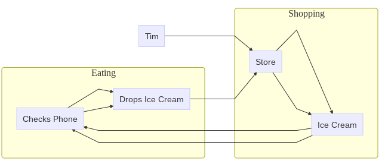

```{r setup, include=FALSE}
## Global options
knitr::opts_chunk$set(cache = FALSE, message = FALSE, warning = FALSE)
library(knitr)
library(kableExtra)
library(magick)
library(tidyverse)
library(DiagrammeR)

```

This tutorial will introduce you to **Failure Modes and Effects Analysis (FMEA)** in R!

# 0. Getting Started

Please open up last week's [RStudio.Cloud project](https://rstudio.cloud/project/2812893). Start a new R script (File \>\> New \>\> R Script). Save the R script as `lesson_3.R`. And let's get started!

## 0.1 Load Packages

```{r}
# Load tidyverse, which contains dplyr and most data wrangling functions
library(tidyverse)
# Load DiagrammeR, which we'll use to make diagrams today!
library(DiagrammeR) 

```

# 1. Example: Ben and Jerry's Ice Cream

Ben and Jerry's main headquarters is in Waterbury, VT, just outside of Burlington, where it makes *a lot* of ice cream. (It's also fun to visit.) Their staff likely has to take considerable care to make sure that all that ice cream stays refrigerated! Suppose Ben and Jerry's has decided to build a new ice cream production plant in Ithaca, NY.

For the sake of Ben and Jerry's (nay, the world!) let's use Failure Modes and Effects Analysis (FMEA) to identify any hypothetical vulnerability that might occur at this new ice cream business!

```{r, echo = FALSE, fig.height=0.5, fig.align='center'}
# Ben & Jerry's Ice Cream Image
knitr::include_graphics("https://www.benjerry.com/files/live/sites/systemsite/files/flavors/category-refresh/header_mobile_0019_our_flavors_US.jpg")
```

## Scope & Resolution

As our scope, we're going to just focus on **melting**. What are all the possible ways that ice cream could melt during this process? Melting would have several negative impacts, such as getting exposed to heat, bacteria, and, worst of all, melting the ice cream! This example is primarily people-centric, because it's important to remember that *people* are part of our technological systems!

## Block Diagram

First, we're going to make a **block diagram**. We can do this using the `mermaid` function from the `DiagrammeR` package. `mermaid` is a popular language for coding small diagrams, and `DiagrammeR` lets us draw them in `R`! `mermaid` will help you map out exactly what is happening in your six sigma case studies.

How does it work? We take a bunch of small `character` values, like `"graph TB"`, `"a"`, `"b"`, and `"a-->b"`, and we `paste()` them together into a single big string that the `mermaid` function reads. When we `paste()` them, we have to be sure that every value goes on a separate line, so we separate them by using `collapse = "\n "`. `"\n"` is a handy shortcut that means, *linebreak!* Let's do a quick example, then we'll apply it to our hypothetical Ben and Jerry's example.

### Example Block Diagram with `mermaid`

```{r}
# Let's make a big vector of values, using c()
example <- c(
  # say it's a graph, going Left-to-Right (LR)
  "graph LR", 
    # list out our main nodes
    "a[Tim]",
    "z[Coffee]",
    # make a subgraph 
    # (a box to contain some nodes)
    "subgraph Process",
      # Put at least one node in it
      "b[Froth Milk]",
      "c[Brew Coffee]",
      "d[Pour in Milk]",
    # Close the subgraph
    "end",
    # Draw relationships
    "a-->b",
    "b-->c",
    "c-->d",
    "d-->z")
# Check it out!
example
```

If we `paste()` that `example` with `collapse = "\n "`, we can see it's all just one big value now.

```{r}
example %>% 
  paste(collapse = "\n ")
```

And if we append `mermaid()` to that, we can get a really nice chart!

```{r}
example %>% 
  paste(collapse = "\n") %>% 
  mermaid()
```

Whohoo! You made your first `mermaid` plot!

##

<br>

<br>

<br>

# LC #1 {.tabset .tabset-pills}

## Question

Try making your own `mermaid` plot now, which tells the following tragedy, which I hope will not happen to you:

-   You go to the store, buy ice cream, try to check your phone, drop your ice cream, go back to store, buy ice cream, check phone again, and drop ice cream again. (True story! A sad day.)

-   Make sure to include at least 1 subgraph and 3 relationships.

## Answer

```{r}
# Here's one of several ways you could draw that!
mystory <- c("graph LR",
  "a[Tim]",
  # Start a subgraph about what happens in the store
  "subgraph Shopping",
    "b[Store]",
    "c[Ice Cream]",
    # end subgraph
  "end",
  # Start subgraph about what happens when eating
  "subgraph Eating",
    "d[Checks Phone]",
    "e[Drops Ice Cream]",
    # end subgraph
  "end",
  # Add interactions
  # Tim goes to store
  "a-->b",
  # Buys ice cream at store
  "b-->c",
  # Checks phone
  "c-->d",
  # Drops Ice cream
  "d-->e",
  # Goes back to store
  "e-->b",
  # Buys ice cream again
  "b-->c",
  # Looks at phone
  "c-->d",
  # Drops ice cream again
  "d-->e"
)
```

And visualize it!

```{r, eval = FALSE}
mystory %>%
  paste(collapse = "\n ") %>%
  mermaid()
```

```{r, echo = FALSE, out.width = "100%"}

```

##

<br>

<br>

# 2. Diagram of Ice Cream Shipment

Let's try and visualize what the process of shipping out ice cream looks like once it has been made, using `mermaid`. To make this easier, we can do it piecemeal, a few lines at a time, saved into logically named vectors.

First, let's get the starting settings of our graph! We'll name it `intro`.

```{r}
# Get the basic graph, going left-to-right
intro <- "graph LR"
```

Second, let's get a `subgraph` of people! We'll call it `subgraph_people`. *(Note: whenever we make multi-line chunks, gotta bind that stuff together using `paste()!`)*

```{r}
subgraph_people <- c(
  # Make a subgraph
  "subgraph People",
    # Draw people in circles with ()
    "w1(Worker 1)",
    "w2(Worker 2)",
    "w3(Worker 3)",
  # Conclude the subgraph
  "end") %>%
  # remember to bind it together
  paste(collapse = "\n")
```

Third, let's get a subgraph of events these people are involved in. We'll call it `subgraph_events`.

*Note: `mermaid` understands some `HTML`, so to get breaks in the labels, we're going to use `<br>` below.*

```{r}
subgraph_events <- paste(
  # Make another subgraph
  "subgraph Events",
    # Draw events as boxes with []
    "freezer[Freeze<br>Ice Cream]",
    "loading[Load<br>onto Truck]",
    "transport[Transport<br>to Store]",
  # Conclude the subgraph
  "end",
  sep = "\n ")
```

Fourth, let's list out the ways our nodes are related, and we'll call it `ties`.

```{r}
# Draw main ties
ties  <- paste(
  # Worker 1 puts ice cream in Freezer
  "w1 --> freezer",
  # Worker 2 loads ice cream into Truck
  "w2 --> loading",
  # Worker 3 transports ice cream to Store
  "w3 --> transport",
  # Also, Worker 2 takes the ice cream from the Freezer for loading
  "freezer --> w2",
  # And Worker 3 drives the ice cream from loading dock to Store
  "loading --> w3",
  sep = "\n ")

```

Alright! Let's visualize this chart!

```{r}
c(intro, 
    # Add subgraphs of nodes
    subgraph_people,
    subgraph_events,
    # Add ties
  ties) %>%
  # Paste them together
  paste(collapse = "\n ") %>%
  # And visualize it!
  mermaid()

```

### Diagram Failures

Now, we could imagine that there are several potential failure modes here. Let's add them to our drawing!

First, we'll make a `subgraph` of failures aptly named `subgraph_fail`

```{r}
subgraph_fail <- c(
  # Make another subgraph
  "subgraph Failures",
    "fail_break[freezer breaks]",
    "fail_time[left out too long]",
    "fail_eat[worker eats it]",
  # Conclude subgraph
  "end") %>%
  # Bind it!
  paste(collapse = "\n ")
```

Second, we'll compile a list of relationships, or ways our nodes could lead to these failures.

```{r}
failures <- c(
  # Worker 1 could leave ice cream out before freezing
  #"w1 --> fail_time",
  # Worker 1 could eat the ice cream before freezing
  #"w1 --> fail_eat",
  # Frezzer could break
  "freezer --> fail_break",
  # Worker 2 could leave ice cream out while loading
  "loading --> fail_time",
  # Worker 2 could eat the ice cream while loading
  "loading --> fail_eat",
  # Worker 3 could leave the ice cream out in transit
  "transport --> fail_time",
  # Worker 3 could eat the ice cream in transit
  "transport --> fail_eat") %>%
  # bind it!
  paste(collapse = "\n ")
```

So what does our new diagram look like?

```{r}
c("graph LR", 
    # Add subgraphs of nodes
    subgraph_people,
    subgraph_events,
    # Add ties
  ties,
    # Add subgraph of failure nodes  
      subgraph_fail,
    # Add ways possible failures
      failures
  ) %>%
  # Paste them together
  paste(collapse = "\n ") %>%
  # And visualize it!
  mermaid()

```

There's so much you can do with `mermaid`, but for now, this will do.

# 3. Measuring Criticality

FMEA includes uses 3 measures to calculate a **criticality** index, meaning the *overall risk of each combination of severity and underlying conditions.*

\$ severity \times occurence \times detection = criticality \$

Each gets classified on a scale from 1-10:

-   `severity`: 1 = none, 10 = hazardous/catastrophic

-   `occurrence`: 1 = almost impossible, 10 = almost certain

-   `detection`: 1 = almost certain, 10 = almost impossible

These will produce a `criticality` index from 1 to 1000. Suppose we want to be 99% sure that our technology won't fail and negatively impact society. We would need a `criticality` index (also known as RPN) of `990` points or less! (Because `1000 - 10 = 990)`.)

So, let's analyze them!

We'll make a tidy `data.frame()` of each of the ways our `block diagram` could fail, which were contained above in `failures`. We'll call this data.frame `f`.

```{r}
f <- tibble(
  # Make a vector of routes to failure
  failure_mode = c(
    "freezer --> fail_break",
    "loading --> fail_time",
    "loading --> fail_eat",
    "transport --> fail_time",
    "transport --> fail_eat")
)

  # Worker 2 could leave ice cream out while loading
  # Worker 2 could eat the ice cream while loading
  # Worker 3 could leave the ice cream out in transit
  # Worker 3 could eat the ice cream in transit

```

Next, we're going to make a few judgement calls.

### Estimate Severity

What's the `severity` of the effects of these failures, on a scale from 1 (low) to 10 (high)? We'll `mutate()` the `data.frame` to include a new column `severity`, and save it as a new data.frame `f1`.

-   `fail_break`: It's pretty bad it the freezer breaks; that could ruin days worth of product. Let's call that an `8`. Not catastrophic, but not good for the company!

-   `fail_time`: It's not great it a single shipment gets left out and melts while waiting for pickup. But it's just one shipment. Let's call that a `5`.

-   `fail_eat`: How much ice cream could one worker really eat? That's probably a `1`.

```{r}
f1 <- f %>%
  mutate(severity = c(8, 5, 1, 5, 1))
# Check out the contents!
f1

```

### Estimate Occurrence

How often does this occur, from 1 (almost never) to 10 (almost always)? Let's rank `occurrence` as follows:

-   `fail_break`: It's pretty rare that the freezer would break (eg. `2`).

-   `fail_time`: It's probably somewhat rare that shipments melt (eg. `5`).

-   `fail_eat`: If I were a worker, I would eat that all the time (eg. `8`).

```{r}
f2 <- f1 %>%
  mutate(occurrence = c(2, 5, 8, 5, 8))

```

### Estimate Detection

Finally, how likely is it that we would detect the occurrence? If very likely, that's a `1`. If very unlikely, that's a `10`.

-   `fail_break`: Workers would very quickly detect if the freezer were broken. (eg. `1`).

-   `fail_time`: You might not know it had melted until the product gets to the store. (eg. `8`)

-   `fail_eat`: Might get caught. Low chance. (eg. `3`).

```{r}
f3 <- f2 %>%
  mutate(detection = c(1, 8, 3, 8, 3))
```

<br>

### Estimate Criticality (RPN)

Using our data in `f3`, let's estimate `criticality` (aka RPN, the risk priority number).

```{r}
f4 <- f3 %>%
  mutate(criticality = severity * occurrence * detection)
```

We can add up the `criticality/RPN` to estimate the total risk priority, out of `1000`, which is the `max_criticality` possible. We can divide these two to get the `probability` of system failure. Is that risk greater than `0.010`, aka `0.1%`? If so, bad news!

```{r}
f4 %>%
  summarize(
    total_criticality = sum(criticality),
    max_criticality = 10*10*10,
    probability = total_criticality / max_criticality)
```

Well, that's not good! Looks like the new factory will need to figure out a way to keep their product from melting! (In reality, I'm sure Ben and Jerry's has strict quality control!)

<br>

<br>

# LC #2 {.tabset .tabset-pills}

## Question

What *other* ways could failure occur here? Add three more kinds of failure to your `tibble` `f`, then estimate their `severity`, `occurence`, `detection`, and `criticality`, and recalculate the total probability of `failure` at this ice cream plant.

## Answer

```{r}
fprime <- tibble(
  # Make a vector of routes to failure
  failure_mode = c(
    "freezer --> fail_break",
    "loading --> fail_time",
    "loading --> fail_eat",
    "transport --> fail_time",
    "transport --> fail_eat",
    # Technically, worker 1 could eat it before taking it to freezer
    "w1 --> fail_eat",
    # A fourth worker at the store could eat it before delivering it
    "w4 --> fail_eat",
    # The fourth worker could also leave it out!
    "w4 --> fail_time")
) %>%
  # Estimate quantities of interest
    mutate(severity = c(8, 5, 1, 5, 1, 1, 1, 5),
           occurrence = c(2, 5, 8, 5, 8, 8, 8, 5),
           detection = c(1, 8, 3, 8, 3, 3, 3, 8)) %>%
  # Calculate criticality
  mutate(criticality = severity * occurrence * detection)

# Let's check it out!
fprime
```

```{r}
# Let's calculate the total risk!
fprime %>%
  summarize(
    total_criticality = sum(criticality),
    max_criticality = 10*10*10,
    probability = total_criticality / max_criticality)
```
Ooph! Not good!

<br>

<br>

Great work! All done! See you in class!
