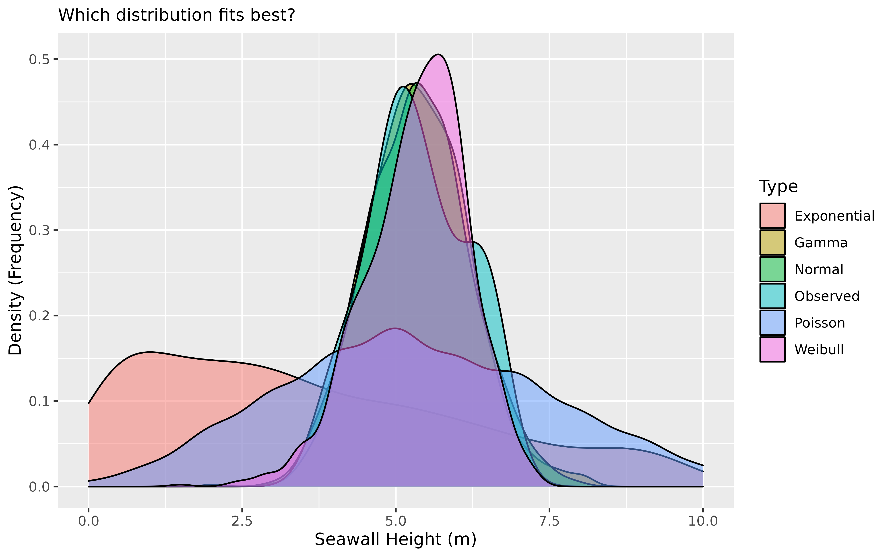
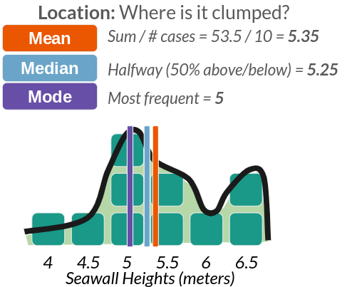
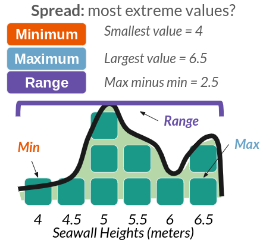
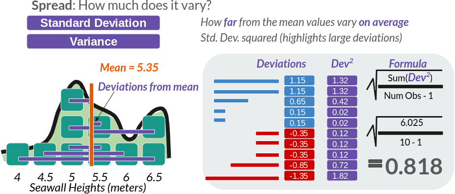

```{r setup, include=FALSE}
## Global options
knitr::opts_chunk$set(cache = FALSE, message = FALSE, warning = FALSE)
library(knitr)
library(kableExtra)
library(magick)
library(cowplot)
```

```{r header, echo = FALSE, out.width="100%", fig.cap="Yay Distributions!"}

```

This tutorial will introduce you to how to code and analyses distributions in R, using descriptive statistics and visualization!

# 0. Getting Started

Please open up last week's [RStudio.Cloud project](https://rstudio.cloud/project/2812893). Start a new R script (File >> New >> R Script). Save the R script as ```workshop_2.R```. And let's get started!

## 0.1 Load Packages

We're going to use extra functions from 3 packages today, including ```ggplot2```, ```dplyr``` (pronounced DIP-LER), and ```MASS```. [Note: Please be sure to load them first, otherwise your functions will *not work*.]

```{r}
library(ggplot2) # for visualization
library(dplyr) # for pipelines!
library(MASS) # for fitting distributions
```

## 0.2 The Pipeline

We'll also be using a new coding symbol today, ```%>%```, called a **pipeline**. Pipelines let us connect **data** to **functions**, with fewer parentheses! 

```{r, fig.align='center', fig.cap="Old-School Pipeline", echo= FALSE}
knitr::include_graphics("images/2_pipe.gif")
```
For example:

```{r}
#  let's make a vector ```x``` and do some operations on it.
x <- c(1,2,3)

# These are the same!
mean(x)
x %>% mean()
```

Using pipelines keeps our code neat and tidy. It lets us run long sequences of code without saving it bit by bit as objects. For example, we can take them ```mean()`` of ```x``` *and* then get the ```length()``` of the resulting vector, all in one sequence. Without a pipeline, you end up in parenthesis hell very quickly.

```{r}
# without pipe
length(mean(x))

# with pipe
x %>% mean() %>% length()
```

Handy, right? To simplify things, there's a special 'hotkey' shortcut for making pipelines too. In Windows and Linux, use ```Ctrl Shift M```. In Mac, use ```Cmd Shift M```.

<br>
<br>


# 1. Distributions

Any vector can be expressed as a **distribution** (especially numeric vectors). A distribution stacks the values in a vector in order from lowest to highest to show the frequency of values. There are several ways to visualize distributions, including **histograms**, **density** plots, **violin plots**, **jitter plots**, **ribbon plots**, and more; the most common are **histograms** and **density** plots, which we will learn today.

For example, **Figure 2** shows our seawall vector from Workshop 1 in part **A** (left). In part **B** (right), that vector is shown as a distribution: its blocks are stacked to make a **histogram** (bars), while the distribution itself (line) is approximated by a curve, known as a **density function.** 

```{r seawall, echo = FALSE, out.width="100%", fig.cap="Figure 2: Seawall Vector as a Distribution"}
library(magick)
library(cowplot)

ggplot() +
  draw_image(image = "images/2_vector.png", x = 0, y = 0.5, width = 0.5, height = 0.5) +
  draw_image(image = "images/2_distribution.png", x = 0.5, y = 0.5, width = 0.5, height = 0.5) +
  draw_image(image = "images/2_distribution_parts.png", x = 0, y = 0, width = 1, height = 0.5) +
  draw_text(text = "A. Vector", x = 0, y = 0.9, hjust = 0, color = "black") +
  draw_text(text = "B. Distribution", x = 0.5, y = 0.9, hjust = 0, color = "black") +
  draw_text(text = "C. Traits of Distribution", x = 0.2, y = 0.55, hjust = 0, color = "black") +
  coord_fixed(xlim = c(0, 1), ylim = c(0, 1)) +
  theme_void() 
```

Any distribution can be described with 4 traits, shown above in part **C**. These include: **Size** (how many values are in it), **Location** (eg. where is it clumped), **Spread** (how much do values vary?), and **Shape** (eg. bell curve).


# LC 1 {.tabset .tabset-pills}

## Question

Using the ```hist()``` function we learned before, draw the histogram of this vector of seawalls, naming the vector ```sw```!

## Answer

Using the ```hist()``` function we learned before, draw the histogram of this vector of seawalls, naming the vector ```sw```!

```{r}
# Many options!

# You could code it as a vector, save it as an object, then use your functions!
sw <- c(4.5, 5, 5.5, 5, 5.5, 6.5, 6.5, 6, 5, 4)
sw %>% hist()
# or you could do it like this!
# hist(sw)
```


# 2. Descriptive Statistics {.tabset .tabset-pills}

What's a statistic? A statistic is a **single number** that **summarizes something about a sample**. That's it! No magic! Statistics is the process of making statistics (eg. many single numbers) so we can understand samples of data! They help people make decisions when faced with uncertainty. We'll learn several functions to make statistics that describe our distributions.

```{r, echo = FALSE, fig.cap = "Table 1: Functions for Describing Distributions"}
data.frame(
  `Trait` = c("Size", "Location", "Spread", "Shape"),
  `Meaning` = c("How many values?", "Where is it clumped?", "How much do values vary?", "What shape does it resemble?"),
  `Type` = c("statistics", "statistics", "statistics", "distributions"),
  
  `Functions` = c("length()", "mean(), median()", 
                  "sd(), var(), range(), quantile()", "rnorm(), rbinom(), rpois(),<br>[skewness & kurtosis - no functions]")
) %>%
  kableExtra::kable(escape = FALSE) %>%
  kable_classic(full_width = FALSE, lightable_options = c("striped", "condensed"))
```

Click on the tabs below to review our functions for Size, Location, and Spread from Workshop 1. (We'll get to shape in a minute.)

## Size

*How big is our sample?* Use ```length()``` on a vector to find the number of values in the vector ```sw``` we made in **LC1.**

```{r}
length(sw)
```

## Location

**Where is our sample clumped?**

```{r echo = FALSE, out.width = "100%", fig.align="center", fig.cap = "Figure 3: Statistics for Location"}

```

Use ```mean()``` and ```median()``` to find the most central values. 

```{r}
sw %>% mean()
```

```{r}
sw %>% median()
```

Fun fact: ```mode()``` doesn't work in R; it's huge pain. You have to use this code instead.

```{r}
sw %>% table() %>% sort(decreasing = TRUE)
```

## Spread (1)

**How much does our sample vary?**

```{r echo = FALSE, out.width = "100%", fig.align="center", fig.cap = "Figure 4: Statistics for Spread"}

```

Use ```quantile()``` to check for any percentile in a vector, from 0 (min) to 0.5 (median) to 1 (max). If you have ```quantile()```, you don't need to remember ```min()```, ```max()```, ```range()```, or even ```median()```.

```{r}
sw %>% quantile(probs = 0) # min
sw %>% quantile(probs = 1) # max
```

## Spread (2)

### Standard Deviation

But we can also evaluate how much our values vary from the mean *on average* - the standard deviation, often abbreviated as \( \sigma \) (sigma). This is written as:

$ \sigma = \sqrt{ \Sigma \frac{ (x_{i} - mean) }{ n - 1 } }  $

```{r echo = FALSE, out.width = "100%", fig.align="center", fig.cap = "Figure 5: Standard Deviation, the ultimate Statistic for Spread"}

```

We can calculate this 'by hand', or use the ```sd()``` function.

```{r}
# Calculating in R still faster than on your own!
sqrt( sum((sw - mean(sw))^2) / (length(sw) - 1) )

# Get the standard deviation by code!
sw %>% sd()
```
### Variance

Sometimes, we might want the variance, which is the standard deviation *squared*. This accentuates large deviations in a sample.

```{r}
# Get the variance!
sw %>% var()
sd(sw)^2
# See? var = sd^2!
```

### Coefficient of Variation (CV)

We could also calculate the coefficient of variation (CV), meaning how great a share of the mean does that average variation constitute? (Also put, how many times does the mean fit into the standard deviation.)

```{r}
sd(sw) / mean(sw)
```
The standard deviation constitutes `r round(sd(sw) / mean(sw), 2)*100`% of the size of the mean seawall height.

### Standard Error (SE)

But these numbers don't have much meaning to us, unless we know seawalls *really well*. Wouldn't it be nice if we had a kind of uniform measure, that told us *how big is the variation in the data*, given how big the data is itself? Good news! We do! We can calculate the *sample size-adjusted variance* like so:

```{r}
var(sw) / length(sw)
# or 
sd(sw)^2 / length(sw)
```
This means we could take this set of seawalls and compare it against samples of coastal infrastructure in Louisiana, in Japan, in Australia, and make *meaningful comparisons*, having adjusted for sample size. 

However, sample-size adjusted variance is a little bit of a funky concept, and so it's much more common for us to use the sample-size adjusted standard deviation, more commonly known as the **standard error**, or ```se```.

$ SE = \frac{ \sigma }{ \sqrt{n} } = \sqrt{ \frac{ \sigma^{2} }{ n  } } = \sqrt{  \frac{ variance}{ n }}  $  

```{r}
# Calculated as:
se <- sd(sw) / sqrt(length(sw))
# Or as:
se <- sqrt( sd(sw)^2 / length(sw)   )
# Or as:
se <- sqrt( var(sw) / length(sw))
# See standard error
se
```

# LC 2 {.tabset .tabset-pills}

## Question

Suppose we collected data on 10 randomly selected chunks of cheese from a production line! We measured their **moisture in grams (g) in each product** We want to make sure we're making some quality cheesy goodness, so let's find out how much those moisture (cheesiness) levels vary! 

The moisture in our cheese weighed 5.52 g, 5.71 g, 5.06 g, 5.10 g, 4.98 g, 5.50 g, 4.81 g, 5.55 g, 4.74 g, & 5.39 g.

1. Please convert the following values into a vector named ```cheese```! 

2. How much did moisture levels vary, on average?

3. We need to compare these levels with cheese produced in Vermont, France, and elsewhere. What's the coefficient of variance and standard error for these moisture levels?

## Answer

1. Please convert the following values into a vector named ```cheese```! 

```{r}
cheese <- c(5.52, 5.71, 5.06, 5.10, 4.98, 5.50, 4.81, 5.55, 4.74, 5.39)
```

2. How much did moisture levels vary, on average?

3. We need to compare these levels with cheese produced in Vermont, France, and elsewhere. What's the coefficient of variance and standard error for these moisture levels?

```{r}
# Coefficient of variation
cv <- sd(cheese) / mean(cheese)
# Check it!
cv
```

```{r}
# Standard Error
se <- sd(cheese) / sqrt(length(cheese))
# Check it
se
```

```{r}
# When you're finished, remove extra data.
remove(cheese, se, cv)
```


##

<br>
<br>

# 3. Describing Shape

How then do we describe the *shape* of a distribution? We can use **skewness** and **kurtosis** for this. There's no direct function for skewness or kurtosis in `R`, but as you'll see below, we can quickly calculate it using the functions we already know.

## Skewness

Skewness describes whether the bulk of the distribution sits to the left or right of the center, and its formula are written out below. It is commonly estimated using the formula on the left, while the formula on the right closely approximates it. (We're going to use the right-hand formula below, since it's a little cleaner.)

$$ Skewness = \frac{ \sum^{N}_{i=1}{(x - \bar{x})^{3}  / n } }{ [\sum^{N}_{i=1}{ (x - \bar{x})^{2} / n }]^{3/2} } \approx  \frac{ \sum^{N}_{i=1}{ (x - \bar{x})^{3} } }{ (n - 1) \times \sigma^{3} }  $$

When people say that a certain person's perspective is *skewed*, they mean, it's very far from the `mean`. In this case, we want to know, how skewed are the heights of seawalls *overall* compared to the mean? To figure this out, we'll need **4 ingredients:**

- $x_{i \to N}$: our vector of values (seawall heights! `sw`)

- $N$: the length of our vector (how many seawalls? `length(sw)`)

- $\bar{x}$: our mean value: (the mean seawall height? `mean(sw)`)

- $\sigma$: the standard deviation of our vector (how much do the seawall heights vary on average? `sd(sw)`)

Yeah! You just used them a bunch! So let's calculate skewness!

First, we measure `diff`, *how far is each value from the mean*?

```{r}
diff <- sw - mean(sw)
# Check it out!
diff
```

`diff` measures how far / how skewed each of these values ($x$) are from the mean $\bar{x}$). See the visual below!

```{r, echo = FALSE, message=FALSE, warning = FALSE}
mylines <- data.frame(
  x = sort(sw),
  xbar = mean(sw)) %>%
  mutate(diff = x-xbar,
  diff3 = diff^3) %>%
  # Identify the approx height of dot for each
  group_by(x) %>%
  mutate(y = 1:n(),
         yvar = rnorm(n = n(), mean = y, sd = 0.15)) %>%
  ungroup() %>%
  mutate(id = 1:n())


ggplot() +
  # Draw density function
  geom_density(mapping = aes(x = sw, y = ..scaled..*3),
               fill = "#648FFF", color = "#648FFF", alpha = 0.25) + 
  # Draw lines between dots  
  geom_segment(data = mylines, 
               mapping = aes(x = x, y = yvar, xend = xbar, 
                             yend = yvar, group = id), color = "darkgrey", size = 1.5) +
  # Get dots
  geom_point(data = mylines, mapping = aes(x = x, y = y), 
             size = 20, shape = 22, color = "#373737", fill = "#648FFF", stroke = 1) +
  # Get median line
  geom_vline(mapping = aes(xintercept = mean(sw)), color = "#DC267F", size = 2, alpha = 0.5) +
  # Get median dot
  geom_point(data = mylines, mapping = aes(x = xbar, y = 1),
             shape = 22, size = 20, fill = "#DC267F",  alpha = 1) +
  # Add a lable
  geom_text(mapping = aes(x = mean(sw), y = 1, label = "Mean"), vjust = 0) +
  coord_fixed(ratio = 1/3, ylim = c(0.5, 5)) +
  # Add a label
  geom_text(mapping = aes(x = 5.5, y = 4, 
                          label = "diff = x - mean(x)\n\nHorizontal Lines\nare deviations!"),
            hjust = 0, size = 5) +
  # Add a theme
  theme_minimal(base_size = 14) +
  theme(panel.grid = element_blank()) +
  labs(x = "Seawall Height (sw)", y = "Frequency (#)")

```

Next, we're going to *cube* `diff`, to emphasize *extreme* differences from the mean Squaring would turn everything positive, but we care whether those differences are positive or negative, so we cube it instead.

```{r}
diff^3
```

Then, we're going to get a few helper values, like:

```{r}
# Get the sample-size
# To be conservative, we'll subtract 1; this happens often in stats
n <- length(sw) - 1

# Get the standard deviation
sigma <- sw %>% sd()
```

Now, we can calculate, on *average*, how big are these cubed differences?

```{r}
sum(diff^3) / n
```

Well, that's nifty, how do we compare this funky number to other samples? We're going to need to put it in terms of a common unit, a *"standard"* unit - like the standard deviation! Plus, we'll have to *cube* the standard deviation, so that it's in the same terms as our numerator $diff^{3}$.

```{r}
skew <- sum(diff^3) / ( n * sigma^3) 
# Check it!
skew
```

Voila! A standardized measure you can use to compare the skew of our sample of seawalls to any other sample! For comparison, here are a few *other* values of skew we might possibly get.

```{r, echo = FALSE}
stat_mean <- mean(sw)
stat_var <- var(sw)
stat_skew <- moments::skewness(sw)
stat_kurtosis <- moments::kurtosis(sw)

# Simulate some skewed data
exlong <- data.frame(
  center = PearsonDS::rpearson(
    n = 1000, moments = c(mean = stat_mean, variance = stat_var,
                          skew = stat_skew, kurtosis = stat_kurtosis)),
  right = PearsonDS::rpearson(
    n = 1000, moments = c(mean = stat_mean, variance = stat_var,
                          skew = stat_skew*20, kurtosis = stat_kurtosis)),
  left = PearsonDS::rpearson(
    n = 1000, moments = c(mean = stat_mean, variance = stat_var,
                          skew = stat_skew*-20, kurtosis = stat_kurtosis))) %>%
  tidyr::pivot_longer(cols = -c(), names_to = "type", values_to = "x") %>%
  bind_rows(data.frame(type = "obs", x = sw)) %>%
  mutate(type = type %>% recode_factor(
    "obs" = "Observed",
    "center" = "Minimal Skew (0)",
    "right" = "Right-Skewed (+)",
    "left" = "Left-Skewed (-)"))

exstat <- exlong %>%
  group_by(type) %>%
  summarize(xbar = mean(x),
            sumdiff3 = sum( (x - xbar)^3),
            sample_size = n() - 1,
            sigma = sd(x),
            skew = sumdiff3 / (sample_size * sigma^3))

ggplot(data = exlong) +
  geom_density(mapping = aes(x = x, y = ..scaled.., fill = type), alpha = 0.75) +
  scale_y_continuous(labels = NULL) +
  geom_text(data = exstat, mapping = aes(x = xbar, y = 1.10, 
                                         label = paste("Skew = ", round(skew, 2),sep = ""),
                                         color = type)) +
  xlim(3, 8) +
  ylim(0, 1.25) +
  facet_wrap(~type) +
  theme_classic(base_size = 14) +
  theme(panel.grid = element_blank()) +
  theme(axis.ticks.y = element_blank(),
        axis.text.y = element_blank()) +
  labs(x = "Seawall Heights (sw)", y = "Frequency (#)",
       fill = "Type of Skew") +
  scale_fill_manual(breaks = c("Observed", "Minimal Skew (0)", "Right-Skewed (+)", "Left-Skewed (-)"),
                    values = c("darkgrey", "#FFB000", "#DC267F", "#648FFF"),
                    guide = "none") +
  scale_color_manual(breaks = c("Observed", "Minimal Skew (0)", "Right-Skewed (+)", "Left-Skewed (-)"),
                     values = c("darkgrey", "#FFB000", "#DC267F", "#648FFF"),
                     guide = "none")
```

```{r, echo = FALSE}
remove(ex, exlong, exstat, mylines)
```

## Kurtosis

Kurtosis describes how tightly bound the distribution is around the mean. Is it extremely pointy, with a narrow distribution (high kurtosis), or does it span wide (low kurtosis)? We can estimate it using the formula on the left, and the formula on the right is approximately the same.

$$ Kurtosis = \frac{ \sum^{N}_{i=1}{(x - \bar{x})^{4}  / n } }{ [\sum^{N}_{i=1}{ (x - \bar{x})^{2} / n }]^2 } \approx  \frac{ \sum^{N}_{i=1}{ (x - \bar{x})^{4} } }{ (n - 1) \times \sigma^{4} }  $$

Like skew, we calculate how far each value is from the mean, *but* we take those differences to the 4th power ($(x - \bar{x})^{4}$), which *hyper-accentuates* any extreme deviations and returns only positive values. Then, we calculate the sample-size adjusted average of those differences. Finally, to measure it in a consistent unit comparable across distributions, we divide by the standard deviation taken to the 4th power; the powers in the numerator and denominator then more-or-less cancel each other out.

```{r}
moments::skewness(sw)
# 0.2565
x <- sw

sum(   (x - mean(x))^3  ) / ((length(x) - 1) *sd(x)^3)

a <- sum(  (x - mean(x))^3 ) / length(x)

b <- (sum( (x - mean(x))^2 ) / length(x))^(3/2)

a/b
# 0.256


```


```{r}
# Get the differences again
diff <- sw - mean(sw)

# And take them to the fourth power
diff^4
```

They're all positive! 

Next, same as above, we'll get the conservative estimate of the sample size (n - 1) and the standard deviation.

```{r}
# Get the sample-size
# To be conservative, we'll subtract 1; this happens often in stats
n <- length(sw) - 1

# Get the standard deviation
sigma <- sw %>% sd()
```

So when we put it all together...

```{r}
kurt <- sum(diff^4) / ( n * sigma^4)
# Check it!
kurt
```

We can measure kurtosis! A pretty normal bell curve has a kurtosis of about `3`, so our data doesn't demonstrate much kurtosis. Kurtosis ranges from 0 to infinity (it is always positive), and the higher it goes, the pointier the distribution!

```{r, echo = FALSE, message = FALSE, warning = FALSE}
# The pearsonDS package can let us simulate data with specific skew and kurtosis 
stat_mean <- mean(sw)
stat_var <- var(sw)
stat_skew <- moments::skewness(sw)
stat_kurtosis <- moments::kurtosis(sw)

# Simulate some data with varying levels of kurtosis
exlong <- data.frame(
  medium = PearsonDS::rpearson(
    n = 1000, moments = c(mean = stat_mean, variance = stat_var,
                          skew = stat_skew, kurtosis = stat_kurtosis)),
  low = PearsonDS::rpearson(
    n = 1000, moments = c(mean = stat_mean, variance = stat_var,
                          skew = stat_skew, kurtosis = stat_kurtosis %>% sqrt() )),
  high = PearsonDS::rpearson(
    n = 1000, moments = c(mean = stat_mean, variance = stat_var,
                          skew = stat_skew, kurtosis = stat_kurtosis^2))) %>%
  tidyr::pivot_longer(cols = -c(), names_to = "type", values_to = "x") %>%
  bind_rows(data.frame(type = "obs", x = sw)) %>%
  mutate(type = type %>% recode_factor(
    "obs" = "Observed",
    "low" = "Low Kurtosis (<3)",
    "medium" = "Medium Kurtosis (3)",
    "high" = "High Kurtosis (>3)"))

exstat <- exlong %>%
  group_by(type) %>%
  summarize(xbar = median(x),
            sumdiff4 = sum( (x - xbar)^4),
            sample_size = n() - 1,
            sigma = sd(x),
            kurtosis = sumdiff4 / (sample_size * sigma^4))


ggplot(data = exlong) +
  geom_density(mapping = aes(x = x, y = ..scaled.., fill = type), alpha = 0.75) +
  scale_y_continuous(labels = NULL) +
  geom_text(data = exstat, mapping = aes(x = xbar, y = 1.10, 
                                         label = paste("Kurtosis = ", round(kurtosis, 2),sep = ""),
                                         color = type)) +
  xlim(3, 8) +
  ylim(0, 1.25) +
  facet_wrap(~type) +
  theme_classic(base_size = 14) +
  theme(panel.grid = element_blank()) +
  theme(axis.ticks.y = element_blank(),
        axis.text.y = element_blank()) +
  labs(x = "Seawall Heights (sw)", y = "Frequency (#)",
       fill = "Type of Skew") +
  scale_fill_manual(breaks = c("Observed", "Low Kurtosis (<3)", "Medium Kurtosis (3)", "High Kurtosis (>3)"),
                    values = c("darkgrey", "#FFB000", "#DC267F", "#648FFF"),
                    guide = "none") +
  scale_color_manual(breaks = c("Observed", "Low Kurtosis (<3)", "Medium Kurtosis (3)", "High Kurtosis (>3)"),
                    values = c("darkgrey", "#FFB000", "#DC267F", "#648FFF"),
                    guide = "none")
```

Finally, just a heads up: As mentioned above, there are a few different formulas floating around there for skewness and kurtosis, so don't be too surprised if your numbers vary when calculating it in one package versus another versus by hand. (But, if the numbers are extremely different, that's probably a sign something is up.)

<br>
<br>


# LC 3 {.tabset .tabset-pills}

## Question

A contractor is concerned that the majority of seawalls in her region might skew lower than their region's vulnerability to storms requires. Assume (hypothetically) that our sample's seawalls are the appropriate height for our level of vulnerability, and that both regions share the same level of vulnerability. 

- The `mean` seawall in her region is about the same height as in our sample (`~5.35`), but how do the `skewness` and `kurtosis` of her region's seawalls compare to our sample? 

- Her region has 12 seawalls! Their height (in meters) are 4.15, 4.35, 4.47, 4.74, 4.92, 5.19, 5.23, 5.35, 5.55, 5.70, 5.78, & 7.16. 

- Calculate these statistics and interpret your results in a sentence or two.

## Answer

```{r}
# Make a vector of these 12 seawalls
x <- c(4.15, 4.35, 4.47, 4.74, 4.92, 5.19, 5.23, 5.35, 5.55, 5.70, 5.78, 7.16)

# Calculate skewness
skewness <- sum( (x - mean(x))^3) / ((length(x) - 1) * sd(x)^3)

# Calculate Kurtosis
kurtosis <- sum( (x - mean(x))^4) / ((length(x) - 1) * sd(x)^4)

# View them!
c(skewness, kurtosis)
```

- Her region's seawalls are somewhat positively, right skewed, with a skewness of about `+0.90`. This is much more skewed than our hypothetical area's seawalls, which are skewed at just `+0.02`. 

- But, her region's seawalls' traits are much more closely clustered around the mean than ours, with a kurtosis of `3.52` compared to our `1.88`. 

- Since both hypothetical regions have comparable levels of vulnerability to storm surges, her region's seawalls do appear to skew low.

```{r,echo = FALSE}
remove(skewness, kurtosis, x)
```

##

<br>
<br>

# 4. Simulating Distributions

Finally, to describe **shape**, we need some shapes to compare our distributions to. Fortunately, the ```rnorm()```, ```rbinom()```, ```rpois()```, and ```rgamma()``` functions allow us to draw the shapes of several common distributions. **Table 2** shows the shape of these distributions, and their ranges.

```{r, echo = FALSE, fig.caption = "Table 2: Examples of Simulated Distributions"}
mysample <- bind_rows(
  tibble(value = rnorm(1000, mean = 0, sd = 1), type = "Normal"),
  tibble(value = rpois(1000, lambda = 1), type = "Poisson"),
  tibble(value = rgamma(1000, shape = 1, scale = 1 / 0.5), type = "Gamma"),
  tibble(value = rexp(1000, rate = 1 / 0.5), type = "Exponential"),
  tibble(value = rweibull(1000, shape = 1, scale = 1), type = "Weibull"),
  tibble(value = rbinom(1000, size = 1, prob = 0.5), type = "Binomial")
) %>%
  mutate(type = factor(type, levels = c("Normal",  "Poisson","Gamma", "Exponential", "Weibull", "Binomial"))) %>%
  group_by(type) %>%
  mutate(value = scale(value))


data.frame(
  Distributions = c("Normal", "Poisson", "Gamma", "Exponential", "Weibull", "Binomial"),
  Span = c("-Inf to +Inf",  "0, 1, 2, 3...", "0.1, 2.5, 5.5, +Inf", "same", "same", "0 vs. 1"),
  `Function` = c("rnorm()", "rpois()", "rgamma()", "rexp()", "rweibull()", "rbinom()"),
  Parameters = c("mean, sd", "lambda (mean)", "shape, rate", "rate", "shape, scale",  "probability"),
  Example = "") %>% 
  kable() %>%
  kable_classic(full_width = FALSE, lightable_options = c("striped", "condensed")) %>%
  column_spec(5, image = spec_hist(split(mysample$value, mysample$type)))

```

To determine what kind of distribution our vector has, we can visually compare it using **simulation**. We can compare our real observed distribution against random distributions to determine whether our data matches the shape of a normal vs. poisson distribution, for example.

To do so, let's get some statistics from our data to help us visualize what a distribution with those traits would look like. As our raw data, let's use our vector of seawall heights ```sw```.

```{r}
# Let's remake again our vector of seawall heights
sw <- c(4.5, 5, 5.5, 5, 5.5, 6.5, 6.5, 6, 5, 4)
```

To simulate, you feed your simulator function (1) ```n``` values to draw and (2) any required statistics necessary for computing draws from that distribution. (For example, ```rnorm()``` requires the mean and standard deviation.) 

Fortunately, statisticians have figured out for us 2 ways to figure out what statistics to provide. First, there are a few equations called **method of moments estimators** that do a great job of estimating those statistics. Alternatively, we can ask ```R``` to compute the values of those statistics using the ```MASS``` package's ```fitdistr()```. We'll show both below.

## Normal Distribution

```rnorm()``` randomly generates for us any number of values randomly sampled from a normal distribution. We just need to supply: (1) ```n``` values to draw, (2) the ```mean``` of that distribution, and (3) the ```sd``` of that distribution.

```{r}
# For example
mymean <- sw %>% mean()
mysd <- sw %>% sd()

# simulate!
mynorm <- rnorm(n = 1000, mean = mymean, sd = mysd)

# Visualize!
mynorm %>% hist()
```

How do ```mymean``` and ```mysd``` compare to the ```fitdistr()``` estimates?

```{r}
mymean
```

```{r}
mysd
```
Let's compare with ```fitdistr()```!

```{r}
sw %>% fitdistr(densfun = "normal")
```
Pretty darn close! Great!


## Poisson Distribution

```rpois()``` randomly samples integers (eg. 0, 1, 2, 3) from a poisson distribution, based on ```lambda```, the average rate of occurrence. We can approximate that by taking the mean of ```sw```.

```{r}
mypois <- rpois(1000, lambda = mymean)

mypois %>% hist()
```
Results in a somewhat skewed distribution, bounded at zero.

So how well did ```mymean``` match up with the 'best' estimate of ```lambda``` from ```fitdistr()```?

```{r}
mymean
```
```{r}
sw %>% fitdistr(densfun = "Poisson")
```
Excellent!


## Gamma Distribution

```rgamma()``` randomly samples positive real numbers greater than zero from a gamma distribution. It's like the continuous version of ```rpois()```. It requires 2 paramters, ```shape``` and ```rate```. You can estimate these a couple of different ways, but a simple one is to use the **method of moments**, which says that: 

- ```shape``` \( \approx \frac{mean^{2}}{ variance} \).

- ```scale```  \( \approx \frac{variance}{ mean } \).

```{r}
# For shape, we want the rate of how much greater the mean-squared is than the variance.
myshape <- mean(sw)^2 / var(sw)

# For rate, we like to get the inverse of the variance divided by the mean.
myrate <-  1 / (var(sw) / mean(sw) )

# Simulate it!
mygamma <- rgamma(1000, shape = myshape, rate = myrate)

## View it!
mygamma %>% hist()
```
So how well did ```myshape``` and ```myrate``` match up with the 'best-fit' estimates from ```fitdistr()```?

```{r}
myshape
```
```{r}
myrate
```
```{r}
sw %>% fitdistr(densfun = "gamma")
```
Pretty good! In the same ballpark.


## Exponential Distribution

```rexp()``` randomly simulates positive real numbers over zero from an [exponential distribution](https://en.wikipedia.org/wiki/Exponential_distribution). Here, the **method of moments** says:

- ```rate``` \( \approx \frac{ 1 }{ mean }) \)

```{r}
# We'll name this myrate2!
myrate_e <- 1 / mean(sw)

# Simulate it!
myexp <- rexp(n = 1000, rate = myrate_e)

# Visualize it!
myexp %>% hist()
```

How then did ```myrate_e``` match up with the estimates from ```fitdistr()```?

```{r}
myrate_e
```
```{r}
sw %>% fitdistr(densfun = "exponential")
```
Pretty solid!


## Weibull Distribution

```rweibull()``` randomly samples positive real numbers over zero too, but from a [Weibull distribution](https://en.wikipedia.org/wiki/Weibull_distribution). It requires a ```shape``` and ```scale``` parameter, but its **method of moments** equation is pretty complex. Once we get into Weibull distribution territory, it's better to just use ```fitdistr()```. 

```{r}
mystats <- sw %>% fitdistr(densfun = "weibull")

# Here, we're going to extract the estimate for shape
myshape_w <- mystats$estimate[1]

# and the estimate for scale
myscale_w <- mystats$estimate[2]

# simulate!
myweibull <- rweibull(n = 1000, shape = myshape_w, scale = myscale_w)

# View it!
myweibull %>% hist()
```


## Binomial Distribution

Finally, the binomial distribution is a bit of a special case, in that it's mostly only helpful for binary variables (with values 0 and 1). But let's try an example anyways. ```rbinom()``` randomly draws ```n``` simulated values from a set of provided values at a given probability (```prob```). It's usually used for drawing binary variables (0 and 1); a coin flip would have ```prob = 0.5```, or a 50-50 chance. (This time we can't use ```fitdistr()```.)

```{r}
rbinom(n = 10, size = 1, prob = 0.5)
```
To get a meaningful simulation, maybe we calculate the proportion of values that are greater than the ```mean```.

```{r}
# In how many cases was the observed value greater than the mean?
myprob <- sum(sw > mymean) / length(sw)

# Sample from binomial distribution with that probability
mybinom <- rbinom(1000, size = 1, prob = myprob)

# View histogram!
mybinom %>% hist()
```


# 5. Comparing Distributions

Finally, we're going to want to outfit those vectors in nice data.frames (skipping ```rbinom()```), and stack them into 1 data.frame to visualize. We can do this using the ```bind_rows()``` function from the ```dplyr``` package.

```{r}
# Using bind_rows(),
mysim <- bind_rows(
  # Make a bunch of data.frames, all with the same variable names,
  data.frame(x = sw, type = "Observed"),
  # and stack them!
  data.frame(x = mynorm, type = "Normal"),
  data.frame(x = mypois, type = "Poisson"),
  data.frame(x = mygamma, type = "Gamma"),
  data.frame(x = myexp, type = "Exponential"),
  data.frame(x = myweibull, type = "Weibull")
)
```

Next, we can visualize those distributions using ```geom_density()``` in ggplot (or ```geom_histogram()```, really, if that floats your boat).

```{r}
# Let's write the initial graph and save it as an object
g1 <- ggplot(data = mysim, mapping = aes(x = x, fill = type)) +
  geom_density(alpha = 0.5) +
  labs(x = "Seawall Height (m)", y = "Density (Frequency)", 
       subtitle = "Which distribution fits best?", fill = "Type")

# Then view it!
g1
```
Personally, I can't read much out of that, so it would be helpful to narrow in the x-axis a bit. We can do that with ```xlim()```, narrowing to just between values ```0``` and ```10```.

```{r}
g1 +
  xlim(0,10)
```
```{r, include = FALSE}
ggsave(g1 + xlim(0,10), file = "images/2_viz.png", dpi = 500, width = 8, height = 5)
```

Beautiful! Wow! It looks like the **Normal**, **Gamma**, and **Weibull** distributions all do a pretty excellent job of matching the observed distribution.


# LC 4 {.tabset .tabset-pills}

## Question

You've been recruited to evaluate the frequency of Corgi sightings in the Ithaca Downtown. A sample of 10 students each reported the number of corgis they saw last Tuesday in town. Using the method of moments (or ```fitdistr()``` for Weibull) and ```ggplot()```, find out which type of distribution best matches the observed corgi distribution!

Beth saw 5, Javier saw 1, June saw 10(!), Tim saw 3, Melanie saw 4, Mohammad saw 3, Jenny say 6, Yosuke saw 4, Jimena saw 5, and David saw 2.

## Answer

First, let's get the stats.
```{r}
# Make distribution of Corgis
corgi <- c(5, 1, 10, 3, 4, 3, 6, 4, 5, 2)

# Compute statistics for distributions
corgi_mean <- mean(corgi)
corgi_sd <- sd(corgi)
corgi_shape <- mean(corgi)^2 / var(corgi)
corgi_rate <- 1 / (var(corgi) / mean(corgi) )
corgi_rate_e <- 1 / mean(corgi)

# For Weibull, use fitdistr() from MASS package
corgi_stats <- corgi %>% fitdistr(densfun = "weibull")
corgi_shape_w <- corgi_stats$estimate[1]
corgi_scale_w <- corgi_stats$estimate[2]
```
Next, let's bind them together.

```{r}
corgisim <- bind_rows(
  # Get observed vector
  data.frame(x = corgi, 
             type = "Observed"),
  # Get normal dist
  data.frame(x = rnorm(1000, mean = corgi_mean, sd = corgi_sd), 
             type = "Normal"),
  # Get poisson
  data.frame(x = rpois(1000, lambda = corgi_mean), 
             type = "Poisson"),
  # Get gamma
  data.frame(x = rgamma(1000, shape = corgi_shape, rate = corgi_rate), 
             type = "Gamma"),
  # Get exponential
  data.frame(x = rexp(1000, rate = corgi_rate_e), 
             type = "Exponential"),
  # Get weibull
  data.frame(x = rweibull(1000, shape = corgi_shape_w, scale = corgi_scale_w), 
             type = "Weibull")
)
```

Finally, let's visualize it!

```{r}
# Visualize!
ggplot(data = corgisim, mapping = aes(x = x, fill = type)) +
  geom_density(alpha = 0.5) +
  # Narrow it to 0 to 15 to suit plot
  xlim(0,15) +
  labs(x = "Corgi Sightings!", y = "Density (Frequency)")
```

Neat - looks like the Poisson, Gamma, and Weibull function match well, although the Poisson looks pretty odd!


# 6. Next Steps

So now, you know how to use descriptive statistics in R, how to visualize and evaluate a distribution, and how to simulate several different types of distributions! You're well on your way to some serious stats for systems engineering!


