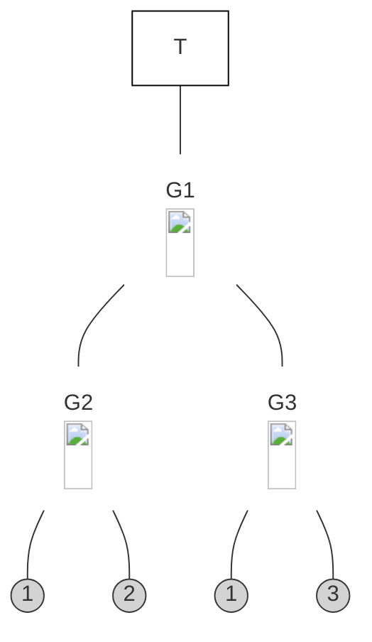

# `mermaid` Fault Tree Template

```mermaid
flowchart TD

%% Nodes
T["T"]
%% [Edit Gates here] ---
G1[G1<img src="https://raw.githubusercontent.com/timothyfraser/sigma/refs/heads/main/images/gate_and.svg" style="height: 50px;"></img>]
G2[G2<img src="https://raw.githubusercontent.com/timothyfraser/sigma/refs/heads/main/images/gate_or.svg" style="height: 50px;"></img>]
G3[G3<img src="https://raw.githubusercontent.com/timothyfraser/sigma/refs/heads/main/images/gate_or.svg" style="height: 50px;"></img>]

%% [Edit nodes here] —--
p1(("1"))
p2(("2"))
p3(("1"))
p4(("3"))

%% Edges
%% [Edit edges here] —--
T --- G1
G1 --- G2
G1 --- G3
G2 --- p1
G2 --- p2
G3 --- p3
G3 --- p4

%% Styling
class T top;
classDef top fill:white,stroke:black;
%% [Edit gate names here] —--
class G1,G2,G3 gates;
%% [Edit point names here] —--
class p1,p2,p3,p4 nodes;
classDef gates fill:#FFFFFF,stroke:#FFFFFF,stroke-width:0px
classDef nodes fill:lightgrey,stroke:#373737,stroke-width:0p
```

