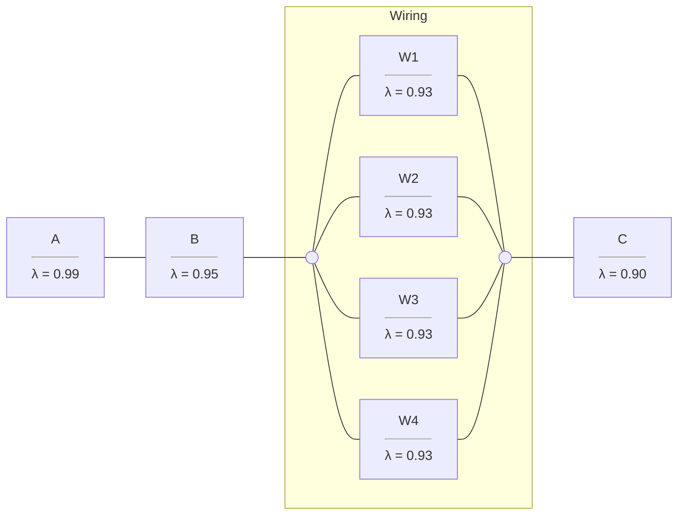
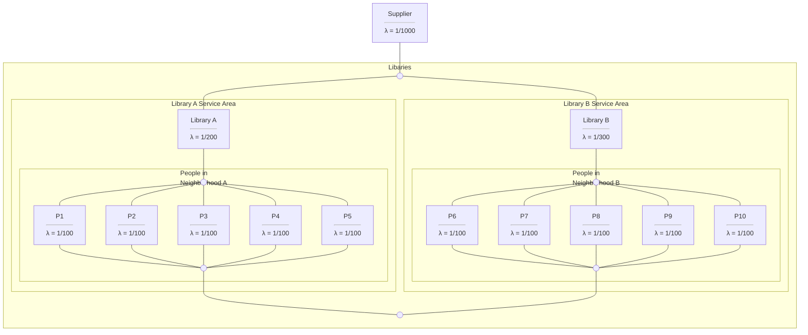

# Recitation 4 
## Diagrams

### Electrical Wiring

<details><summary>Click here to view prompt</summary>
    
Nintendo's joystick contains several parts, each with a unique probability of reliability.
See the diagram saved in workshop_4_diagram.png

- Each wiring unit W1-W4 gets the reliability rate 0.93..
- Part A has a reliability rate of 0.99.
- Part B has a reliability rate of 0.95.
- Part C has a reliability rate of 0.90.

Calculate probability that the overall system remains reliable.


How would the probability change if you added additional components? Add 5 more components to this system, each with a reliability rate of 0.80.  
  
</details>


### Library System

<details><summary>Click here to view prompt</summary>
    
A New York City library system wants to better understand its vulnerability to book loss. They randomly sampled 5 residents from Neighborhood A and B for a total of 10 residents.

-  Residents from neighborhood A use Library A
-  Residents from neighborhood B use Library B
-  Library A tends to lose track of books on the shelf at a rate of 1 book per 200 days.
-  Library B tends to lose track of books on the shelf at a rate of 1 book per 300 days.
-  Residents tend to lose loaned books at a rate of 1 book per 100 days.
-  The library system's supplier loses books at a rate of 1 book per 1000 days.

1.  What is the overall probability that the library system does NOT lose any books in a day? 
2.  How does that probability change over 3 years? 
3.  What is the average failure rate over the first year? Second year? Third year?




</details>


<details><summary>Click for Library Solution</summary>

```r
# Write a failure function
f = function(t, lambda){   1 - exp(-1*t*lambda) }
# Write a reliability function
r = function(t, lambda){ 1 - f(t, lambda) }

 
# Calculate reliability for parallel system of people from neighborhood A    
r_people_a = 1 - f(t = 1, lambda = 1/100)^5

# Calculate reliability for Library A
r_library_a = r(t = 1, lambda = 1/200)

# Calculate reliability for series system of Library A Service Area
r_service_a = r_library_a  *  r_people_a

    
# Calculate reliability for parallel system of people from neighborhood B    
r_people_b = 1 - f(t = 1, lambda = 1/100)^5
    
# Calculate reliability for Library B
r_library_b = r(t = 1, lambda = 1/300)

# Calculate reliability for series system of Library B Service Area
r_service_b = r_library_b * r_people_b
    
# Calculate reliability for parallel system Libraries
r_libraries = 1 - (1 - r_service_a)  * (1 - r_service_b)


# Calculate reliability for supplier
r_supplier = r(t = 1, lambda = 1/1000)
    
# Calculate reliability for overall system
r_system = r_supplier * r_libraries
```
    
If we want, we can write a system function to calculate reliability at any time `t`!
    
```r
# Write an overall system reliability function
r_system = function(t){    
    
# Embed a failure function
f = function(t, lambda){   1 - exp(-1*t*lambda) }
# Embed a reliability function
r = function(t, lambda){ 1 - f(t, lambda) }

# Calculate reliability for parallel system of people from neighborhood A    
r_people_a = 1 - f(t, lambda = 1/100)^5

# Calculate reliability for Library A
r_library_a = r(t, lambda = 1/200)

# Calculate reliability for series system of Library A Service Area
r_service_a = r_library_a  *  r_people_a

    
# Calculate reliability for parallel system of people from neighborhood B    
r_people_b = 1 - f(t, lambda = 1/100)^5
    
# Calculate reliability for Library B
r_library_b = r(t, lambda = 1/300)

# Calculate reliability for series system of Library B Service Area
r_service_b = r_library_b * r_people_b
    
# Calculate reliability for parallel system Libraries
r_libraries = 1 - (1 - r_service_a)  * (1 - r_service_b)


# Calculate reliability for supplier
r_supplier = r(t, lambda = 1/1000)
    
# Finally, calculate and return reliability for overall system
r_supplier * r_libraries
}
```    

Last, we can compute our quantities of interest.
    
```r
# Probability the system loses no books in a day
r_system(t = 1)

# How does the reliability function change over 3 years?
# There are 1095 days in 3 years
data.frame(t = 1:1095) %>%
    mutate(reliability = r_system(t)) %>%
    ggplot(mapping = aes(x = t, y = reliability)) +
    geom_area()

# What's the average failure rate over the first, second, and third years?
afr = function(t1, t2){
    # nest cumulative hazard function
    h = function(t){ -log( r_system(t) ) }
    # Calculate average failure rate
    ( h(t2) - h(t1) ) / (t2 - t1)    
}
    
# Compute it over each year!
afr(t1 = 1, t2 = 365)
afr(t1 = 366, t2 = 730)
afr(t2 = 731, t2 = 1095)
```
    
    
</details>


