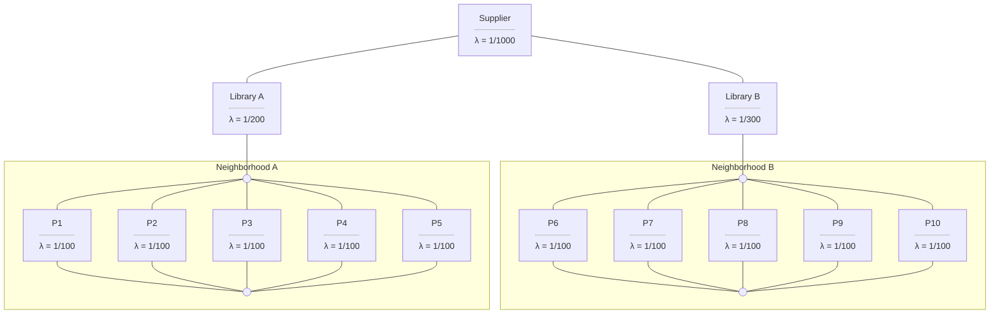

# Recitation 4 
## Diagrams

### Q5. Library System

A New York City library system wants to better understand its vulnerability to book loss. They randomly sampled 5 residents from Neighborhood A, B, C, and D, for a total of 20 residents.

-  Residents from neighborhood A use Library A
-  Residents from neighborhood B use Library B
-  Library A tends to lose track of books on the shelf at a rate of 1 book per 200 days.
-  Library B tends to lose track of books on the shelf at a rate of 1 book per 300 days.
-  Residents tend to lose loaned books at a rate of 1 book per 100 days.
-  The library system's supplier loses books at a rate of 1 book per 1000 days.

1.  What is the overall probability that the library system does NOT lose any books? 
2.  How does that probability change over 3 years? 
3.  What is the average failure rate over the first year? Second year? Third year?

